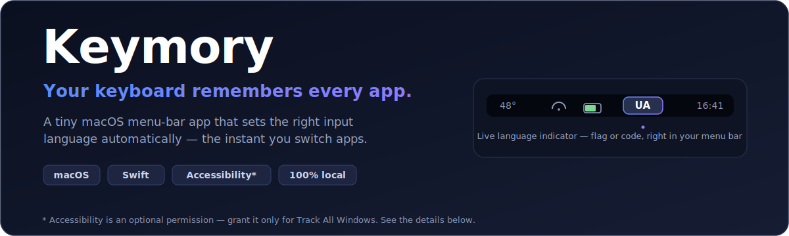

<p align="center">
  
</p>

<h1 align="center">Keymory</h1>

<p align="center">
  <b>The macOS menu-bar app that gives every application its own perfect keyboard language — automatically.</b>
</p>

<p align="center">
  
  
  
  
  
  
  
</p>

---

## 📦 This is the Homebrew tap only

This repository contains **just the Homebrew cask** for installing Keymory. There is no source code here. The app itself — code, issues, releases, license — lives in the main repository:

**→ https://github.com/mekh/keymory**

## ⬇️ Install

```sh
brew tap mekh/keymory
brew install --cask keymory
```

Or in one line:

```sh
brew install --cask mekh/keymory/keymory
```

On first launch, look for the language indicator in your menu bar. To follow pop-up windows too, open the menu, turn on **Track All Windows**, and grant **Accessibility** when prompted (System Settings ▸ Privacy & Security ▸ Accessibility). Turn on **Launch at Login** and let Keymory disappear into the background.

### Uninstall

```sh
brew uninstall --cask keymory          # remove the app
brew uninstall --zap --cask keymory    # also remove its preferences
```

## 🪟 What this build does (no-sandbox)

This tap ships the **non-sandboxed** build of Keymory. On top of remembering the input source for every app, it **actively tracks which window currently owns the keyboard** and switches the language **before you type the first letter** — even for windows that never "activate" their app and therefore fire no app-switch event.

That covers the panels an ordinary per-app switcher can't see, for example:

- **iTerm2** hotkey (drop-down) terminal
- **Spotlight**
- **Raycast**
- **Alfred**
- **1Password** Quick Access
- any other non-activating pop-up window, present or future — there is no per-app list

This is exactly why this build is **not sandboxed**: reading which app holds keyboard focus needs the macOS **Accessibility** API, which the App Sandbox forbids. The core per-app switching works with no permission at all; only the window-tracking feature asks for Accessibility.

### Accessibility is optional

You do **not** have to grant Accessibility. Keymory works without it — it simply does less:

- **Without Accessibility (no permission granted):** Keymory remembers and restores the input source every time you switch apps the normal way — Cmd-Tab, clicking an app, opening a window that activates its app. This is the whole core feature, and it needs no permission whatsoever. Keymory never even requests Accessibility until you ask it to.
- **With Accessibility (Track All Windows turned on):** Keymory *additionally* switches the language for pop-up windows that never activate their app — iTerm's hotkey terminal, Spotlight, Raycast, Alfred, 1Password Quick Access — **before you type the first letter**.

So the only thing you give up by leaving Accessibility off is proactive switching inside those non-activating pop-ups; regular app switching keeps working fully. You can toggle the permission on or off at any time from the menu — Keymory never needs it for anything else.

## 🔒 Privacy & safety

Keymory is designed to be provably boring. It does **not**, in any form:

- **Touch the network.** It opens no sockets, makes no connections, and ships no analytics, telemetry, accounts, or cloud sync. Nothing ever leaves your Mac.
- **Take screenshots or record the screen.** It uses no screen-capture APIs and does not read other apps' window contents.
- **Log your input.** It reads no key codes and uses none of the keyboard/event-input (CGEvent) APIs. It cannot see what you type.
- **Read your data.** The Accessibility permission is used for one thing only: to read the **bundle identifier of the app that currently has keyboard focus** (e.g. `com.googlecode.iterm2`). Never your keystrokes, never text, never window contents.

What it stores stays on-device and is tiny: a plain map of `app bundle id → keyboard input source id`, kept in `UserDefaults` (`~/Library/Preferences/toxic0der.Keymory.plist`). No files, no database, no cloud. The app has **no third-party dependencies and no cryptography**.

Full details are in the [Privacy Policy](PRIVACY.md).

## 🔍 Don't trust — verify

Keymory is open source, and the codebase is small enough to read in one sitting:

- **Browse the full source** (this build lives on the `no-sandbox` branch): https://github.com/mekh/keymory/tree/no-sandbox
- The **only** file that touches the Accessibility API is [`Keymory/AXActivationDetector.swift`](https://github.com/mekh/keymory/blob/no-sandbox/Keymory/AXActivationDetector.swift) — start there and confirm for yourself that it reads only the focused app's identity.

Don't want to read Swift? Point an AI at the repo and ask it for a security audit — the project is small, so it's quick and cheap to review end to end.
